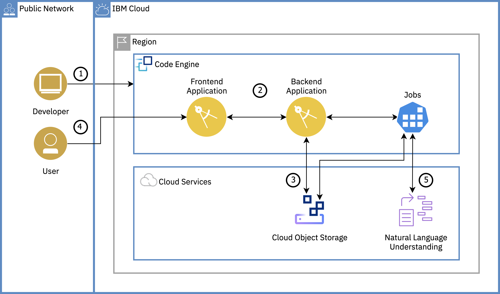

# Welcome to our IBM Cloud Code Engine Workshop

In this tutorial, you will learn about IBM Cloud™ Code Engine by deploying a text analysis with Natural Language Understanding application. You will create a Code Engine project, select the project and deploy Code Engine entities - applications and jobs - to the project. You will learn how to bind IBM Cloud services to your Code Engine entities. You will also understand the auto-scaling capability of Code Engine where instances are scaled up or down (to zero) based on incoming workload. In this workshop we will use a simplified version of the full IBM Cloud Solution Tutorial for Code Engine ([https://cloud.ibm.com/docs/solution-tutorials?topic=solution-tutorials-text-analysis-code-engine](https://cloud.ibm.com/docs/solution-tutorials?topic=solution-tutorials-text-analysis-code-engine)).

1. Developer creates a Code Engine project and deploys a frontend and a backend Code Engine application.
2. Developer connects the frontend (UI) app to the backend by modifying the frontend application to set an environment variable value to point to the backend application's endpoint.
3. Developer provisions the required cloud services and binds them to the backend application and jobs by creating secrets.
4. User uploads a text file(s) via the frontend app that is stored in Object Storage through the backend application.
5. User runs a Code Engine job via the backend to analyze text by pushing the text to Natural Language Understanding. The result is then saved to Object Storage and displayed in the frontend app when the user clicks the refresh button.

.png>)

